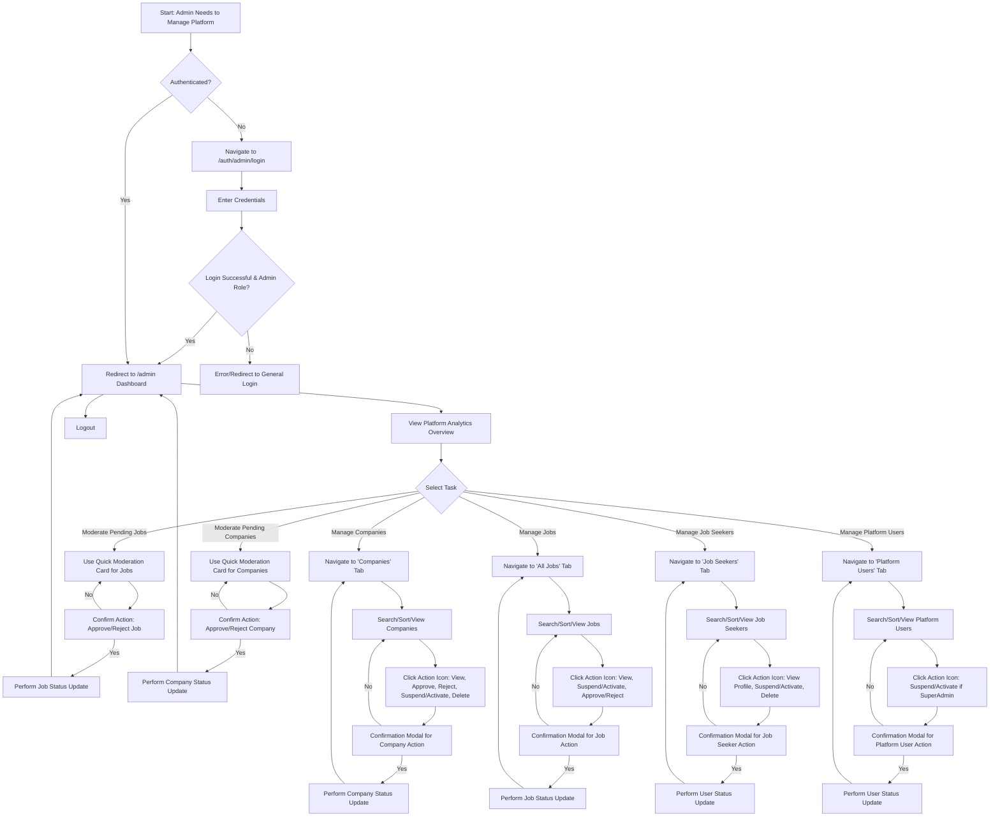

# JobBoardly - Admin Features Guide

This document outlines the features, user flows, and technical interactions specific to the Administrator and Super Administrator roles within the JobBoardly platform.

## 1. Core Responsibilities

Administrators (and Super Admins) are responsible for overseeing the platform's integrity, managing users, and ensuring the quality of content (job postings and company profiles).

## 2. Key Features

### 2.1. Admin Dashboard

The central hub for all administrative tasks, accessible after logging in via the Admin Login page. The dashboard presents an overview and a tabbed interface for organized management. All critical actions (status changes, deletions) are protected by confirmation modals.

- **Platform Analytics Overview (Dashboard):**

  - **Total Job Seekers**: Count of all registered job seeker accounts.
  - **Total Companies**: Count of all registered company profiles.
  - **Total Jobs**: Count of all job postings in the system.
  - **Approved Jobs**: Count of currently active and approved job postings.
  - **Total Applications**: Count of all applications submitted on the platform.

- **Quick Moderation Cards (Dashboard Overview):**

  - **Pending Job Approvals**: Allows admins to quickly review and approve (`✅`) or reject (`❌`) newly submitted job postings without navigating to the full jobs table.
  - **Pending Company Approvals**: Enables swift approval (`✅`) or rejection (`❌`) of new company profiles.

- **Companies Management Tab:**

  - **View**: Table displays Company Name, Website, Status (e.g., `Pending`, `Approved`, `Rejected`, `Suspended`, `Deleted`), Jobs Posted count, Applications Received count, and Creation Date.
  - **Actions (Icon-based, with confirmation modals)**:
    - `👁️ View Company Profile`: Opens the public company profile page in a new tab.
    - `✅ Approve`: Changes company status to 'Approved'. (For 'Pending' companies)
    - `❌ Reject`: Changes company status to 'Rejected'. (For 'Pending' companies)
    - `🚫 Suspend`: Changes company status to 'Suspended'. Recruiters from suspended companies can log in but have limited access (cannot post/edit jobs, edit company profile; can edit personal details). (For 'Approved' or 'Active' companies)
    - `✅ Activate`: Changes company status to 'Active' (if previously suspended) or 'Approved' (if previously rejected/pending). Restores full access for recruiters.
    - `🗑️ Delete (Soft)`: Changes company status to 'Deleted'. Recruiters from deleted companies will effectively be locked out of employer features after login (Firebase Auth succeeds, but app context logs them out/restricts access). Data is retained.
  - **Functionality**: Includes search by name/website, sorting by columns, and pagination.

- **All Jobs Management Tab:**

  - **View**: Table shows Job Title, Company Name, Status (e.g., `pending`, `approved`, `rejected`, `suspended`), Applicant Count, Creation Date, and Last Updated Date.
  - **Actions (Icon-based, with confirmation modals)**:
    - `👁️ View Public Job Page`: Opens the public job details page.
    - `🚫 Suspend`: Changes job status to 'Suspended'. Suspended jobs are not visible to job seekers, and recruiters cannot manage applicants or edit the job. (For 'Approved' jobs)
    - `✅ Activate`: Changes job status to 'Approved'. (For 'Suspended' or 'Rejected' jobs)
    - `✅ Approve`: Changes job status to 'Approved'. (For 'Pending' jobs)
    - `❌ Reject`: Changes job status to 'Rejected'. (For 'Pending' jobs)
  - **Functionality**: Includes search by title/company, sorting by columns, and pagination.

- **Job Seekers Management Tab:**

  - **View**: Table lists Job Seeker Name, Email, Status (e.g., `active`, `suspended`, `deleted`), Profile Searchable (Yes/No), Jobs Applied count, Last Active date, and Joined Date.
  - **Actions (Icon-based, with confirmation modals)**:
    - `👁️ View Profile`: Opens the candidate's profile preview page (as an employer/admin would see it).
    - `🚫 Suspend`: Changes job seeker account status to 'Suspended'. Suspended users can log in but have limited functionality (cannot apply for jobs, edit main profile sections, save jobs, use AI job matcher; can view jobs, change password, some settings).
    - `✅ Activate`: Changes job seeker account status to 'Active'. Restores full functionality.
    - `🗑️ Delete (Soft)`: Changes job seeker account status to 'Deleted'. Deleted users cannot log in (Firebase Auth login succeeds, but app context immediately logs them out). Data is retained.
  - **Functionality**: Includes search by name/email, sorting by columns, and pagination.

- **Platform Users Management Tab (Admins/SuperAdmins):**
  - **View**: Table displays Name, Email, Role (Admin/SuperAdmin), Status, Last Active date, and Joined Date.
  - **Actions (Icon-based, with confirmation modals)**:
    - `🚫 Suspend / ✅ Activate`: Toggles Admin/SuperAdmin account status.
    - _Restriction_: SuperAdmins can manage other Admins and SuperAdmins. Regular Admins cannot manage other platform users. Users cannot suspend/activate themselves.
  - **Functionality**: Includes search by name/email, sorting by columns, and pagination.

### 2.2. Protected Admin Route & Login

- Access to the admin dashboard (`/admin`) is strictly limited to users with "admin" or "superAdmin" roles.
- A dedicated admin login page is available at `/auth/admin/login`.

### 2.3. SuperAdmin Capabilities

- SuperAdmins have all the capabilities of regular Admins.
- Additionally, SuperAdmins can manage (suspend/activate) regular Admin accounts.

## 3. User Journey Map (Admin)

## 4. Page Routes

| Route               | Description                                                                  | Access Level       |
| :------------------ | :--------------------------------------------------------------------------- | :----------------- |
| `/auth/admin/login` | Dedicated login page for administrators.                                     | Public (for login) |
| `/admin`            | Main admin dashboard with tabs for managing various aspects of the platform. | Admin, SuperAdmin  |

## 5. Key "API" Interactions (Data Flows)

Admins interact primarily with the Firebase Firestore database to manage platform data. There are no traditional REST APIs for admin actions; operations are direct database manipulations triggered by UI events (with confirmation modals).

- **Fetching Data for Tables (e.g., Companies, Jobs, Users):**

  - **Action**: Admin navigates to a management tab.
  - **Interaction**: Queries Firestore collections (`companies`, `jobs`, `users`) with appropriate filters, ordering, and pagination.
  - **Data**: Retrieves arrays of Company, Job, or UserProfile objects.

- **Fetching Platform Analytics:**

  - **Action**: Admin dashboard loads.
  - **Interaction**: Uses Firestore's `getCountFromServer` on `users` (filtered by role), `companies`, `jobs` (total and filtered by status 'approved'), and `applications` collections.
  - **Data**: Retrieves numerical counts for display.

- **Updating Status (e.g., Approve/Reject/Suspend/Delete Company/Job/User):**

  - **Action**: Admin clicks an action icon, confirms in modal.
  - **Input Data**: ID of the entity (company, job, user), the new status string, and optionally a moderation reason.
  - **Interaction**: Updates the specific document in Firestore (e.g., in the `companies` collection, sets the `status` field to 'approved' and `updatedAt` to server timestamp).
  - **Output/Effect**: Document status is changed in the database, UI updates to reflect the change.

- **Counting Related Items (e.g., Jobs per company, Applicants per job):**
  - **Action**: Data tables often display counts.
  - **Interaction**: Uses Firestore's `getCountFromServer` with queries (e.g., count jobs where `companyId` matches, count applications where `jobId` matches).
  - **Data**: Retrieves a numerical count.

## 6. Future Updates (Potential Enhancements)

- **Advanced Platform Analytics**: Visual charts (e.g., using Recharts) and stats on user registration trends, job posting trends, application rates over time (e.g., last 7/30 days).
- **Time-Based Filtering for Analytics**: Allow viewing stats for specific periods.
- **Detailed Audit Logs**: Comprehensive logs of all admin actions for security and accountability.
- **Bulk Actions**: Ability to select multiple items (e.g., jobs, users) and perform actions like suspend/approve in bulk.
- **Communication Tools**: Ability to send platform-wide announcements or messages to specific user groups (e.g., all employers).
- **Custom Reporting**: Generate custom reports based on platform data.
- **Content Moderation Tools**: AI-assisted flagging of potentially problematic content in job descriptions or company profiles.
- **More Granular Role Permissions**: Ability to assign specific moderation tasks to different admin levels if needed.

---

_This guide is intended for informational purposes for the JobBoardly team._
