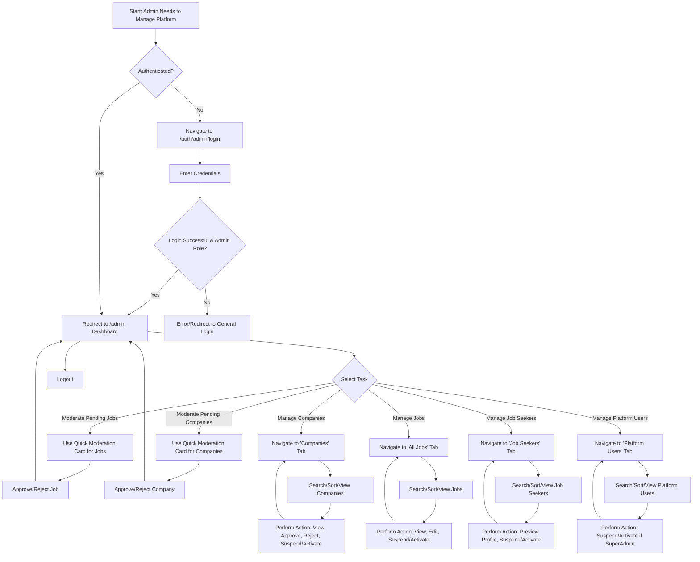

# JobBoardly - Admin Features Guide

This document outlines the features, user flows, and technical interactions specific to the Administrator and Super Administrator roles within the JobBoardly platform.

## 1. Core Responsibilities

Administrators (and Super Admins) are responsible for overseeing the platform's integrity, managing users, and ensuring the quality of content (job postings and company profiles).

## 2. Key Features

### 2.1. Admin Dashboard

The central hub for all administrative tasks, accessible after logging in via the Admin Login page. The dashboard presents a tabbed interface for organized management.

- **Quick Moderation Cards (Dashboard Overview):**

  - **Pending Job Approvals**: Allows admins to quickly review and approve (`✅`) or reject (`❌`) newly submitted job postings without navigating to the full jobs table.
  - **Pending Company Approvals**: Enables swift approval (`✅`) or rejection (`❌`) of new company profiles.

- **Companies Management Tab:**

  - **View**: Table displays Company Name, Website, Status (e.g., `Pending`, `Approved`, `Rejected`, `Suspended`), Jobs Posted count, Applications Received count, and Creation Date.
  - **Actions (Icon-based)**:
    - `👁️ View Company Profile`: Opens the public company profile page in a new tab.
    - `✅ Approve`: Changes company status to 'Approved'.
    - `❌ Reject`: Changes company status to 'Rejected'.
    - `🚫 Suspend / ✅ Activate`: Toggles company status between 'Suspended' and 'Active' (or 'Approved' if previously pending/rejected). Suspending a company also suspends its associated recruiters.
  - **Functionality**: Includes search by name/website, sorting by columns, and pagination.

- **All Jobs Management Tab:**

  - **View**: Table shows Job Title, Company Name, Status (e.g., `pending`, `approved`, `rejected`, `suspended`), Applicant Count, Creation Date, and Last Updated Date.
  - **Actions (Icon-based)**:
    - `👁️ View Public Job Page`: Opens the public job details page.
    - `✏️ Edit Job`: Redirects to the employer's job editing interface for that specific job.
    - `🚫 Suspend / ✅ Activate`: Toggles job status between 'Suspended' and 'Approved'.
  - **Functionality**: Includes search by title/company, sorting by columns, and pagination.

- **Job Seekers Management Tab:**

  - **View**: Table lists Job Seeker Name, Email, Status (e.g., `active`, `suspended`), Profile Searchable (Yes/No), Jobs Applied count, Last Active date, and Joined Date.
  - **Actions (Icon-based)**:
    - `👁️ Preview Job Seeker Profile`: Opens the candidate's profile preview page (as an employer would see it).
    - `🚫 Suspend / ✅ Activate`: Toggles job seeker account status.
  - **Functionality**: Includes search by name/email, sorting by columns, and pagination.

- **Platform Users Management Tab (Admins/SuperAdmins):**
  - **View**: Table displays Name, Email, Role (Admin/SuperAdmin), Status, Last Active date, and Joined Date.
  - **Actions (Icon-based)**:
    - `🚫 Suspend / ✅ Activate`: Toggles Admin/SuperAdmin account status.
    - _Restriction_: SuperAdmins can manage other Admins and SuperAdmins. Regular Admins cannot manage other platform users. Users cannot suspend/activate themselves.
  - **Functionality**: Includes search by name/email, sorting by columns, and pagination.

### 2.2. Protected Admin Route & Login

- Access to the admin dashboard (`/admin`) is strictly limited to users with "admin" or "superAdmin" roles.
- A dedicated admin login page is available at `/auth/admin/login`.

### 2.3. SuperAdmin Capabilities

- SuperAdmins have all the capabilities of regular Admins.
- Additionally, SuperAdmins can manage (suspend/activate) regular Admin accounts.

## 3. User Journey Map (Admin)

## 4. Page Routes

| Route               | Description                                                                  | Access Level       |
| :------------------ | :--------------------------------------------------------------------------- | :----------------- |
| `/auth/admin/login` | Dedicated login page for administrators.                                     | Public (for login) |
| `/admin`            | Main admin dashboard with tabs for managing various aspects of the platform. | Admin, SuperAdmin  |

## 5. Key "API" Interactions (Data Flows)

Admins interact primarily with the Firebase Firestore database to manage platform data. There are no traditional REST APIs for admin actions; operations are direct database manipulations triggered by UI events.

- **Fetching Data for Tables (e.g., Companies, Jobs, Users):**

  - **Action**: Admin navigates to a management tab.
  - **Interaction**: Queries Firestore collections (`companies`, `jobs`, `users`) with appropriate filters, ordering, and pagination.
  - **Data**: Retrieves arrays of Company, Job, or UserProfile objects.

- **Updating Status (e.g., Approve/Reject/Suspend Company/Job/User):**

  - **Action**: Admin clicks an action icon (Approve, Reject, Suspend, Activate).
  - **Input Data**: ID of the entity (company, job, user), the new status string, and optionally a moderation reason.
  - **Interaction**: Updates the specific document in Firestore (e.g., in the `companies` collection, sets the `status` field to 'approved' and `updatedAt` to server timestamp).
  - **Output/Effect**: Document status is changed in the database, UI updates to reflect the change.

- **Counting Related Items (e.g., Jobs per company, Applicants per job):**
  - **Action**: Data tables often display counts.
  - **Interaction**: Uses Firestore's `getCountFromServer` with queries (e.g., count jobs where `companyId` matches, count applications where `jobId` matches).
  - **Data**: Retrieves a numerical count.

## 6. Future Updates (Potential Enhancements)

- **Platform Analytics Dashboard**: Visual charts and stats on user registration, job posting trends, application rates, etc.
- **Advanced User Management**: More granular role permissions, ability to assign specific moderation tasks.
- **Content Moderation Tools**: AI-assisted flagging of potentially problematic content in job descriptions or company profiles.
- **Audit Logs**: Detailed logs of all admin actions for security and accountability.
- **Bulk Actions**: Ability to select multiple items (e.g., jobs, users) and perform actions like suspend/approve in bulk.
- **Communication Tools**: Ability to send platform-wide announcements or messages to specific user groups.
- **Custom Reporting**: Generate custom reports based on platform data.

---

_This guide is intended for informational purposes for the JobBoardly team._
