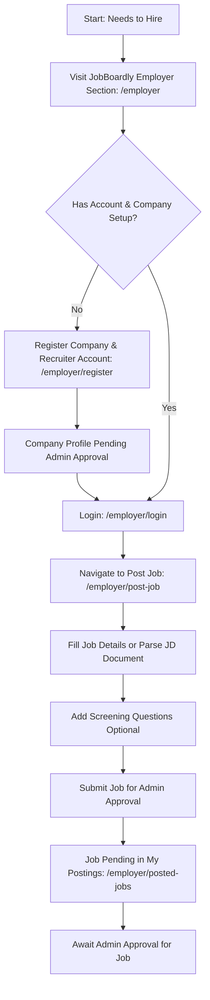
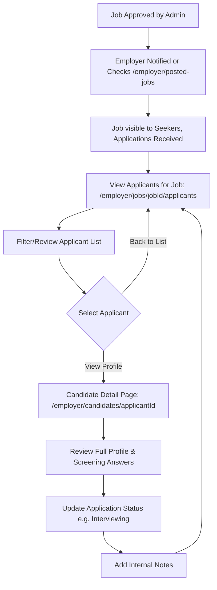
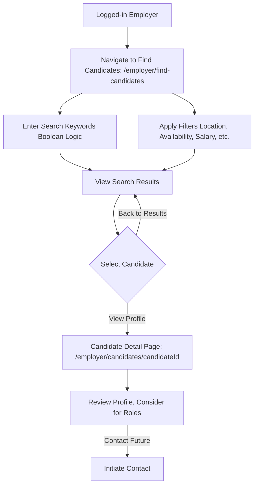

# JobBoardly - Employer Features Guide

This guide provides an overview of the features and functionalities available to Employers and Recruiters on the JobBoardly platform.

## 1. Core Goal

To empower employers to efficiently find and connect with qualified candidates by providing tools for job posting, company profile management, applicant tracking, and AI-driven candidate matching.

## 2. Key Features

### 2.1. Authentication & Account Management

- **Secure Registration (`/employer/register`)**:
  - Employers register by providing their name, company name, email, and password.
  - A new company profile is created with 'pending' status upon first employer registration for that company.
  - Social sign-up options (Google, GitHub, Microsoft) are available; company name must be provided if it's a new company.
- **Login (`/employer/login`)**: Secure access for registered employers.
- **Change Password (`/auth/change-password`)**: Dedicated page for updating account passwords.
- **Account Status**: Employer accounts can be 'active' or 'suspended'. Suspended accounts cannot log in.

### 2.2. Company Profile Management (`/profile` if Company Admin)

- **Setup & Manage Company Details**: Company Admins can set up and update:
  - Company Name
  - Description (Markdown supported)
  - Website URL
  - Logo URL
  - Banner Image URL
- **Admin Approval**: New company profiles (and significant updates) require approval from a platform Admin before becoming publicly visible or fully operational.
- **Company Status**: Current status (e.g., `Pending`, `Approved`, `Rejected`, `Suspended`) is visible to the company admin.
- **Recruiter List**: Company Admins can view a list of recruiters associated with their company (recruiter management itself is an admin task).

### 2.3. Job Posting & Management

- **Create & Edit Job Postings (`/employer/post-job`)**:
  - Intuitive form to input job details: Title, Location, Type (Full-time, Part-time, etc.), Remote status, Salary range (Min/Max INR), Skills.
  - **AI Job Description Parsing**: Upload a job description document (PDF, DOCX, TXT). The AI attempts to parse it and pre-fill the form fields. _Note: Plain text (.txt) is recommended for best parsing results._
  - **Screening Questions**: Add custom screening questions (text input, yes/no) to job postings. These questions are presented to job seekers during the application process.
- **Job Status**:
  - New jobs are submitted with a 'pending' status and require platform Admin approval.
  - Editing an existing job displays its current status (e.g., `approved`, `rejected`, `suspended`). Saving edits resubmits the job as 'pending' for re-approval.
- **View Posted Jobs (`/employer/posted-jobs`)**:
  - A dashboard listing all jobs posted by the employer's company.
  - Displays job title, status, and applicant count for each job.
  - Quick links to edit a job or view its applicants.

### 2.4. Applicant Management

- **View Applicants (`/employer/jobs/[jobId]/applicants`)**:
  - See a list of candidates who have applied for a specific job.
  - View applicants' names, headlines, and application dates.
  - Access answers to any screening questions for that job.
  - Filter applicants by their current application status.
- **Application Status Management**:
  - Update the status of an application (e.g., `Reviewed`, `Interviewing`, `Offer Made`, `Hired`, `Rejected By Company`).
  - Add internal notes (visible only to employers from the same company) for each applicant.
- **Dynamic Candidate Detail Pages (`/employer/candidates/[candidateId]`)**:
  - View comprehensive profiles of job seekers who have applied or are found via search.
  - Includes their skills, experience, education, languages, preferences, and resume summary.
  - Download a PDF version of the candidate's profile (if they've enabled it and their profile is viewable).

### 2.5. Candidate Sourcing

- **Candidate Search & Filtering (`/employer/find-candidates`)**:
  - Browse and search through all job seeker profiles marked as 'searchable'.
  - **Advanced Search**:
    - Keyword search supporting basic **boolean logic** (AND, OR, NOT, "exact phrases").
  - **Filters**:
    - Preferred Location.
    - Availability (e.g., Immediate, 2 Weeks Notice).
    - Job Search Status (e.g., Actively Looking, Open to Opportunities).
    - Desired Salary Range (Min/Max INR).
    - Recent Profile Activity (e.g., profile updated in the last 7 days).
    - Minimum Years of Experience.
  - **View Modes**: Grid or List view for search results.
- **AI-Powered Candidate Matching (`/employer/ai-candidate-match`)**:
  - Input a job description (either by pasting text or uploading a document for AI parsing).
  - The AI matches the job description against the database of searchable candidate profiles.
  - Provides a list of relevant candidate UIDs and detailed reasoning for the matches, considering skills, experience, education, preferences, etc.

### 2.6. User Settings (`/settings`)

- Customize basic platform preferences:
  - Theme (Light, Dark, System).
  - Notification preferences (for application updates, etc.).

## 3. User Journey Maps (Employer)

### Journey 1: Company Registration to Posting First Job

### Journey 2: Managing Applicants for an Approved Job

### Journey 3: Finding Candidates via Search

## 4. Page Routes

| Route                                | Description                                                              | Access Level |
| :----------------------------------- | :----------------------------------------------------------------------- | :----------- |
| `/employer`                          | Landing page for employers.                                              | Public       |
| `/employer/register`                 | Employer and new company registration page.                              | Public       |
| `/employer/login`                    | Employer login page.                                                     | Public       |
| `/profile`                           | Manage recruiter profile; if Company Admin, also manage Company Profile. | Employer     |
| `/employer/post-job`                 | Form to create a new job posting or edit an existing one.                | Employer     |
| `/employer/posted-jobs`              | Dashboard listing jobs posted by the employer's company.                 | Employer     |
| `/employer/jobs/[jobId]/applicants`  | View and manage applicants for a specific job.                           | Employer     |
| `/employer/find-candidates`          | Search and filter through profiles of job seekers.                       | Employer     |
| `/employer/candidates/[candidateId]` | View the detailed profile of a specific candidate.                       | Employer     |
| `/employer/ai-candidate-match`       | AI tool to find candidates matching a job description.                   | Employer     |
| `/settings`                          | Manage employer account settings (theme, notifications).                 | Employer     |
| `/auth/change-password`              | Page to change account password.                                         | Employer     |

## 5. Key "API" Interactions (Data Flows with Genkit & Firebase)

Employers use Genkit flows for AI-assisted tasks and interact with Firebase Firestore for data storage and management.

- **Job Description Parsing (`parseJobDescriptionFlow`):**

  - **Action**: Employer uploads a job description document on the `/employer/post-job` page.
  - **Input Data**:
    - `jobDescriptionDataUri`: The JD document as a data URI (Base64 encoded, with MIME type).
  - **Interaction**: Calls the `parseJobDescriptionFlow` Genkit flow.
  - **Output Data (from AI)**: A structured JSON object (`ParseJobDescriptionOutput`) containing:
    - `title?`: string
    - `description?`: string (or error message if parsing failed)
    - `skills?`: string[]
    - `location?`: string
    - `jobType?`: 'Full-time' | 'Part-time' | 'Contract' | 'Internship'
    - `salaryMin?`: number
    - `salaryMax?`: number
  - **Effect**: Parsed data is used to pre-fill the job posting form.

- **AI-Powered Candidate Matching (`aiPoweredCandidateMatching`):**

  - **Action**: Employer inputs/uploads a job description on `/employer/ai-candidate-match`.
  - **Input Data**:
    - `jobDescription`: A string containing the detailed job description.
    - `candidateProfiles`: A string containing a collection of searchable candidate profiles with their details.
  - **Interaction**: Calls the `aiPoweredCandidateMatching` Genkit flow.
  - **Output Data (from AI)**: A structured JSON object (`AIPoweredCandidateMatchingOutput`) containing:
    - `relevantCandidateIDs`: string[] (Array of candidate UIDs, ordered by relevance)
    - `reasoning`: string (Detailed explanation for the matches)
  - **Effect**: Displays matched candidate UIDs and reasoning. Employer can then view these candidate profiles.

- **Company & Job Data (Firebase Firestore):**
  - **Company Profile**: Created/updated in the `companies` collection. Includes details like name, description, URLs, admin/recruiter UIDs, and status (`pending`, `approved`, etc.).
  - **Job Postings**: Created/updated in the `jobs` collection. Includes all job details, `companyId`, `postedById`, status (`pending`, `approved`, etc.), and screening questions.
  - **Application Management**: Employers update the `status` and `employerNotes` fields in `application` documents within the `applications` collection.

## 6. Future Updates (Potential Enhancements)

- **Advanced Applicant Tracking System (ATS) Features**:
  - Customizable application pipelines/stages.
  - Bulk actions on applicants (e.g., send templated emails).
  - Collaborative notes and ratings for applicants by multiple recruiters in the company.
- **Employer Branding Tools**: Enhanced company profile pages with more customization options (e.g., image galleries, videos, employee testimonials).
- **Analytics & Reporting**:
  - Performance metrics for job postings (views, applications, source of applicants).
  - Candidate pipeline reports.
- **Direct Messaging with Candidates**: Secure, in-platform communication.
- **Interview Scheduling Integration**: Connect with calendar tools to schedule interviews.
- **Team Management**: For Company Admins to invite and manage recruiter accounts within their company.
- **Subscription/Billing Management**: If premium features are introduced.
- **AI-Assisted Screening Question Generation**: Suggest relevant screening questions based on job description.

---

_This guide is intended for informational purposes for the JobBoardly team._
