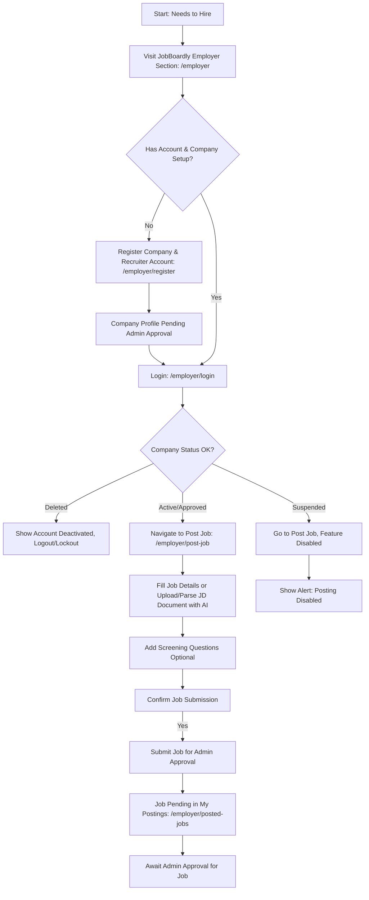
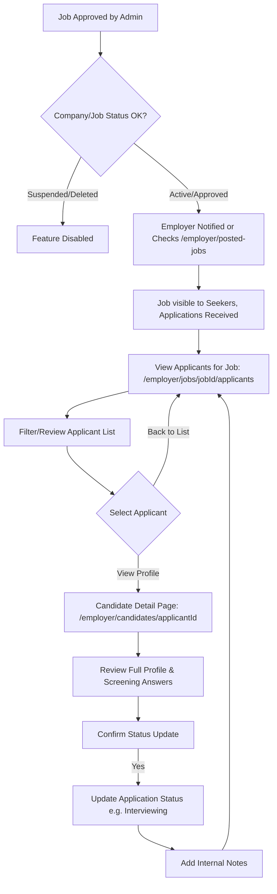

# JobBoardly - Employer Features Guide

This guide provides an overview of the features and functionalities available to Employers and Recruiters on the JobBoardly platform.

## 1. Core Goal

To empower employers to efficiently find and connect with qualified candidates by providing tools for job posting, company profile management, applicant tracking, and AI-driven candidate matching.

## 2. Key Features

### 2.1. Authentication & Account Management

- **Secure Registration (`/employer/register`)**:
  - Employers register by providing their name, company name, email, and password.
  - A new company profile is created with 'pending' status upon first employer registration for that company.
  - Social sign-up options (Google, GitHub, Microsoft) are available; company name must be provided if it's a new company.
- **Login (`/employer/login`)**: Secure access for registered employers.
- **Change Password (`/auth/change-password`)**: Dedicated page for updating account passwords. Requires confirmation.
- **Account Status**: Employer accounts can be 'active' or 'suspended'.
  - **Company Status Impact**: If the associated company profile is 'suspended' by a platform Admin, recruiters can still log in but will have limited access (e.g., cannot post/edit jobs, cannot edit main company profile details, cannot manage applicants for suspended jobs). They can typically edit their personal recruiter details and settings. If the company is 'deleted' by an admin, recruiters will be effectively locked out of employer features after Firebase Authentication succeeds; they will see messages indicating the company account is deactivated.

### 2.2. Company Profile Management (`/profile` if Company Admin)

- **Setup & Manage Company Details**: Company Admins can set up and update:
  - Company Name
  - Description (Markdown supported)
  - Website URL
  - Logo URL
  - Banner Image URL
- **Admin Approval**: New company profiles (and significant updates) require approval from a platform Admin before becoming publicly visible or fully operational.
- **Company Status**: Current status (e.g., `Pending`, `Approved`, `Rejected`, `Suspended`, `Deleted`) is visible to the company admin.
- **Recruiter List**: Company Admins can view a list of recruiters associated with their company (recruiter management itself is an admin task).
- **Saving Changes**: Requires confirmation.
- **Profile Preview (`/employer/profile/preview`)**: Company Admins can preview how their company's public profile page will appear to job seekers and other users.
- _Note_: If the company status is 'suspended' or 'deleted', editing company profile details is disabled.

### 2.3. Job Posting & Management

- **Create & Edit Job Postings (`/employer/post-job`)**:
  - Intuitive form to input job details: Title, Location, Type (Full-time, Part-time, etc.), Remote status, Salary range (Min/Max INR), Skills.
  - **AI Job Description Parsing**: Upload a job description document (PDF, DOCX, TXT). The AI attempts to parse it and pre-fill the form fields. _Note: Plain text (.txt) is recommended for best parsing results with the current AI model._
  - **Screening Questions**: Add custom screening questions (text input, yes/no) to job postings. These questions are presented to job seekers during the application process.
  - Submitting new jobs or updating existing ones requires confirmation.
- **Job Status**:
  - New jobs are submitted with a 'pending' status and require platform Admin approval.
  - Editing an existing job displays its current status (e.g., `approved`, `rejected`, `suspended`). Saving edits resubmits the job as 'pending' for re-approval.
- **View Posted Jobs (`/employer/posted-jobs`)**:
  - A dashboard listing all jobs posted by the employer's company.
  - Displays job title, status, and applicant count for each job.
  - Quick links to edit a job or view its applicants. Actions may be disabled if the job or company is suspended/deleted, or if the job itself is suspended by an admin.
- _Note_: Job posting and management are disabled if the company account is 'suspended' or 'deleted'.

### 2.4. Applicant Management

- **View Applicants (`/employer/jobs/[jobId]/applicants`)**:
  - See a list of candidates who have applied for a specific job.
  - View applicants' names, headlines, and application dates.
  - Access answers to any screening questions for that job.
  - Filter applicants by their current application status.
  - _Note_: Disabled if the company account is 'suspended' or 'deleted', or if the specific job is 'suspended' by an admin.
- **Application Status Management**:
  - Update the status of an application (e.g., `Reviewed`, `Interviewing`, `Offer Made`, `Hired`, `Rejected By Company`). Requires confirmation.
  - Add internal notes (visible only to employers from the same company) for each applicant.
  - _Note_: Disabled if the company account is 'suspended' or 'deleted', or if the specific job is 'suspended'.
- **Dynamic Candidate Detail Pages (`/employer/candidates/[candidateId]`)**:
  - View comprehensive profiles of job seekers who have applied or are found via search.
  - Includes their skills, experience, education, languages, preferences, and resume summary.
  - Download a PDF version of the candidate's profile (if they've enabled it and their profile is viewable).

### 2.5. Candidate Sourcing

- **Candidate Search & Filtering (`/employer/find-candidates`)**:
  - Browse and search through all job seeker profiles marked as 'searchable'.
  - **Advanced Search**:
    - Keyword search supporting basic **boolean logic** (AND, OR, NOT, "exact phrases").
  - **Filters**:
    - Preferred Location.
    - Availability (e.g., Immediate, 2 Weeks Notice).
    - Job Search Status (e.g., Actively Looking, Open to Opportunities).
    - Desired Salary Range (Min/Max INR).
    - Recent Profile Activity (e.g., profile updated in the last 7 days).
    - Minimum Years of Experience.
  - **View Modes**: Grid or List view for search results.
  - **Save Current Search**: Ability to save the current combination of search term and filters as a "Saved Candidate Search" with a custom name. (See Settings for management). Saving a search requires confirmation.
  - _Note_: Disabled if the company account is 'suspended' or 'deleted'.
- **AI-Powered Candidate Matching (`/employer/ai-candidate-match`)**:
  - Input a job description (either by pasting text or uploading a document for AI parsing).
  - The AI matches the job description against the database of searchable candidate profiles.
  - Provides a list of relevant candidate UIDs and detailed reasoning for the matches, considering skills, experience, education, preferences, etc.
  - _Note_: Disabled if the company account is 'suspended' or 'deleted'.

### 2.6. User Settings (`/settings`)

- Customize basic platform preferences:
  - Theme (Light, Dark, System). (Available even if company suspended/deleted).
  - Notification preferences (for application updates, etc.). (Disabled if company suspended/deleted).
- **Manage Saved Candidate Searches**: View a list of your saved candidate search criteria.
  - **Apply Search**: Click a saved search to navigate to the `/employer/find-candidates` page with those filters pre-applied.
  - **Delete Search**: Remove a saved candidate search. Requires confirmation.
  - (Saving new searches is done from the `/employer/find-candidates` page filter sidebar).
  - _Note_: Applying or deleting saved candidate searches disabled if company account 'suspended'/'deleted'.

## 3. User Journey Maps (Employer)

### Journey 1: Company Registration to Posting First Job



### Journey 2: Managing Applicants for an Approved Job



### Journey 3: Previewing Company Profile (Company Admin)

```mermaid
graph TD
    CP_Start[Start: Company Admin wants to see public profile] --> CP_Login[Login as Employer]
    CP_Login --> CP_Nav{Navigate via Account Menu or direct link}
    CP_Nav --> CP_PreviewPage[/employer/profile/preview]
    CP_PreviewPage --> CP_View[View Company Profile as Public Sees It]
    CP_View --> CP_Option{Content OK?}
    CP_Option -- No --> CP_Edit[Go to /profile to Edit Company Details]
    CP_Option -- Yes --> CP_End[End Preview]
```

### Journey 4: Saving and Using a Candidate Search

```mermaid
graph TD
    CS_Start[Start: Employer wants to find candidates] --> CS_Login[Login as Employer]
    CS_Login --> CS_NavToSearch[/employer/find-candidates]
    CS_NavToSearch --> CS_ApplyFilters[Apply various filters and keyword search]
    CS_ApplyFilters --> CS_ViewResults[View search results]
    CS_ViewResults --> CS_SaveOpt{Save this search?}
    CS_SaveOpt -- Yes --> CS_ClickSave[Click 'Save Current Search']
    CS_ClickSave --> CS_NameSearch[Enter search name & Confirm]
    CS_NameSearch --> CS_SearchSaved[Search criteria saved]
    CS_SearchSaved --> CS_Later[Later...]
    CS_Later --> CS_GoToSettings[/settings]
    CS_GoToSettings --> CS_ViewSavedSearches[View 'My Saved Candidate Searches']
    CS_ViewSavedSearches --> CS_SelectSaved{Choose a saved search}
    CS_SelectSaved -- Apply --> CS_RedirectToSearch[Redirect to /employer/find-candidates with filters applied]
    CS_SelectSaved -- Delete --> CS_ConfirmDelete[Confirm Delete]
    CS_ConfirmDelete -- Yes --> CS_SearchDeleted[Search deleted]
    CS_SearchDeleted --> CS_GoToSettings
    CS_ConfirmDelete -- No --> CS_ViewSavedSearches
    CS_SaveOpt -- No --> CS_End[Continue browsing or new search]
```

## 4. Page Routes

| Route                                | Description                                                                                                                                                                       | Access Level             |
| :----------------------------------- | :-------------------------------------------------------------------------------------------------------------------------------------------------------------------------------- | :----------------------- |
| `/employer`                          | Landing page for employers.                                                                                                                                                       | Public                   |
| `/employer/register`                 | Employer and new company registration page.                                                                                                                                       | Public                   |
| `/employer/login`                    | Employer login page. If company is 'deleted', feature access restricted post-auth.                                                                                                | Public                   |
| `/profile`                           | Manage recruiter profile; if Company Admin, also manage Company Profile. Company profile editing restricted if company 'suspended'/'deleted'. Profile save requires confirmation. | Employer                 |
| `/employer/profile/preview`          | Company Admins can preview their public company profile.                                                                                                                          | Employer (Company Admin) |
| `/employer/post-job`                 | Form to create/edit job. Supports AI parsing of JD. Disabled if company 'suspended'/'deleted'. Submitting/updating requires confirmation.                                         | Employer                 |
| `/employer/posted-jobs`              | Dashboard of posted jobs. Actions restricted if company 'suspended'/'deleted' or job 'suspended'.                                                                                 | Employer                 |
| `/employer/jobs/[jobId]/applicants`  | View/manage applicants. Disabled if company 'suspended'/'deleted' or job 'suspended'. Status updates require confirmation.                                                        | Employer                 |
| `/employer/find-candidates`          | Search/filter candidates. Disabled if company 'suspended'/'deleted'. Can save search criteria.                                                                                    | Employer                 |
| `/employer/candidates/[candidateId]` | View candidate profile.                                                                                                                                                           | Employer                 |
| `/employer/ai-candidate-match`       | AI candidate matcher. Disabled if company 'suspended'/'deleted'.                                                                                                                  | Employer                 |
| `/settings`                          | Manage settings (theme, saved candidate searches). Most disabled if company 'suspended'/'deleted', except theme. Deleting saved search needs confirm.                             | Employer                 |
| `/auth/change-password`              | Page to change password. (Accessible if company suspended/deleted). Password change requires confirmation.                                                                        | Employer                 |

## 5. Key "API" Interactions (Data Flows with Genkit & Firebase)

Employers use Genkit flows for AI-assisted tasks and interact with Firebase Firestore for data storage and management. Critical write operations (job posts, applicant status, profile updates, saving/deleting searches) are preceded by confirmation modals.

- **Job Description Parsing (`parseJobDescriptionFlow`):**
  - **Action**: Employer uploads a job description document (PDF, DOCX, TXT) on `/employer/post-job` and clicks "Parse Document".
  - **Input Data**: File data URI.
  - **Interaction**: Calls Genkit flow `parseJobDescriptionFlow`.
    - AI attempts to parse title, description, skills, location, job type, salary range.
  - **Output/Effect**: Form fields on `/employer/post-job` are pre-filled with extracted data. User can then review/edit.
  - _Note_: Currently, plain text files (.txt) are recommended for best parsing results with the AI model.
- **AI-Powered Candidate Matching (`aiPoweredCandidateMatching`):** (As before, but UI access restricted if company suspended/deleted)
- **Company & Job Data (Firebase Firestore):**
  - **Company Profile**: Updated in `companies` collection. Admin approval required for new/significant changes. Saving requires confirmation. Editing restricted if company status is 'suspended' or 'deleted'.
  - **Job Postings**: Created/updated in `jobs` collection. Submitting/updating requires confirmation. Editing/management restricted if company status is 'suspended' or 'deleted' or if job itself is admin-suspended.
  - **Application Management**: Employers update `status` and `employerNotes` in `application` documents. Status updates require confirmation. Management restricted if company/job is suspended/deleted.
- **Saving a Candidate Search:**
  - **Action**: User clicks "Save Current Search" in candidate filter sidebar, names the search, confirms.
  - **Input Data**: Search name (string), current `CandidateFilters` object.
  - **Interaction**: Calls `saveCandidateSearch` in `EmployerActionsContext`.
    - Creates a `SavedCandidateSearch` object (with unique ID, name, filters, `createdAt` timestamp).
    - Updates the `users` document in Firestore by adding the new `SavedCandidateSearch` object to the `savedCandidateSearches` array (using `arrayUnion`).
  - **Effect**: Search criteria saved to employer's user profile.
- **Deleting a Saved Candidate Search:**
  - **Action**: User clicks "Delete" on a saved candidate search in settings, confirms.
  - **Input Data**: `searchId` (string).
  - **Interaction**: Calls `deleteCandidateSearch` in `EmployerActionsContext`.
    - Finds the `SavedCandidateSearch` object by `searchId` in the user's local state (from AuthContext).
    - Updates the `users` document in Firestore by removing the `SavedCandidateSearch` object from the `savedCandidateSearches` array (using `arrayRemove`).
  - **Effect**: Saved search removed from employer's user profile.

## 6. Future Updates (Potential Enhancements)

- **Advanced Applicant Tracking System (ATS) Features**:
  - Customizable application pipelines/stages.
  - Bulk actions on applicants (e.g., send templated emails).
  - Collaborative notes and ratings for applicants by multiple recruiters in the company.
- **Employer Branding Tools**: Enhanced company profile pages with more customizable sections (e.g., "Life at [Company]", testimonials).
- **Analytics & Reporting**: Performance metrics for job postings (views, application rates, source of applicants).
- **Direct Messaging with Candidates**: Secure, in-platform communication.
- **Interview Scheduling Integration**: Connect with calendar tools to streamline interview scheduling.
- **Team Management**: For Company Admins to invite and manage recruiter accounts (currently admin task).
- **Clearer guidance for recruiters** whose company account is suspended or deleted.
- **Enhanced candidate search analytics**: Insights on search effectiveness.

---

_This guide is intended for informational purposes for the JobBoardly team._
