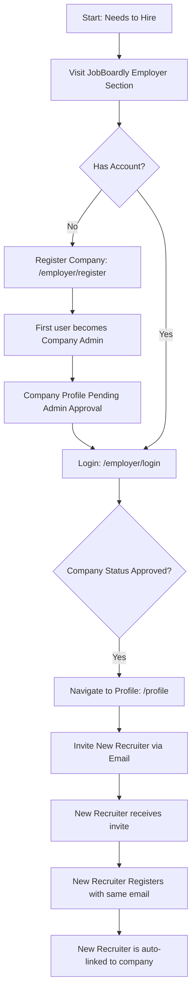

# JobBoardly - Employer Features Guide

This guide provides an overview of the features and functionalities available to Employers and Recruiters on the JobBoardly platform.

## 1. Core Goal

To empower employers to efficiently find and connect with qualified candidates by providing tools for job posting, company profile management, applicant tracking, and AI-driven candidate matching.

## 2. Key Features

### 2.1. Authentication & Account Management

- **Secure Registration (`/employer/register`)**:
  - A user registers by providing their name, company name, email, and password. This first user becomes the **Company Admin**.
  - A new company profile is created with 'pending' status upon first registration.
  - **Invitation-Based System**: Subsequent recruiters join by invitation from a Company Admin. They register with their invited email to be automatically linked to the company as a standard recruiter.
- **Login (`/employer/login`)**: Secure access for registered employers. Correctly redirects to the employer dashboard.
- **Change Password (`/auth/change-password`)**: Dedicated page for updating account passwords. Requires confirmation.
- **Account Status**:
  - **Company Status Impact**: If the associated company profile is 'suspended' by a platform Admin, all recruiters for that company can still log in but will have limited access (e.g., cannot post/edit jobs, cannot edit company profile, cannot manage applicants). If the company is 'deleted' by an admin, recruiters will be effectively locked out of employer features.

### 2.2. Company Profile Management

- **Setup & Manage Company Details (`/employer/company/edit`)**:
  - **Admin-Only Access**: Only users with the `isCompanyAdmin` flag can access this page to set up and update:
    - Company Name
    - Description (Markdown supported)
    - Website URL, Logo URL, Banner Image URL
- **Admin Approval**: New company profiles and significant updates require approval from a platform Admin before becoming publicly visible or fully operational. Submitting edits automatically sets the company status to `pending` for re-approval.
- **Company Status**: Current status (e.g., `Pending`, `Approved`) is visible on the employer's profile page.
- **Recruiter Management (`/profile`)**:
  - **Company Admins** can view a list of current recruiters, see pending invitations, and invite new recruiters (up to a limit of 3 total) by email.
- **Saving Changes**: Requires confirmation.
- **Profile Preview (`/employer/profile/preview`)**: Company Admins can preview how their company's public profile page will appear to job seekers and other users.
- _Note_: Editing the company profile is disabled if the company status is 'suspended' or 'deleted'.

### 2.3. Job Posting & Management

- **Create & Edit Job Postings (`/employer/post-job`)**:
  - All recruiters within a company can create and edit job postings.
  - Intuitive form for all job details, including distinct sections for `responsibilities` and `requirements`.
  - **AI Job Description Parsing**: Upload a job description document (PDF, DOCX, TXT) to have the AI pre-fill the form fields.
  - **Screening Questions**: Add custom screening questions (text input, yes/no supported).
  - Submitting new jobs or updating existing ones requires confirmation.
- **Job Status**:
  - New jobs are submitted with a 'pending' status for admin approval.
  - Editing an existing job resubmits it as 'pending' for re-approval.
- **View Posted Jobs (`/employer/posted-jobs`)**:
  - A dashboard listing all jobs posted by the employer's company, visible to all recruiters in that company.
  - Displays job title, status, and applicant count for each job.
  - Quick links to edit a job or view its applicants.
- _Note_: Job posting and management are disabled if the company account is 'suspended' or 'deleted'.

### 2.4. Applicant Management

- **View Applicants (`/employer/jobs/[jobId]/applicants`)**:
  - See a list of candidates who have applied for a specific job.
  - View applicant details and answers to screening questions.
- **Application Status Management**:
  - Update the status of an application (e.g., `Reviewed`, `Interviewing`, `Hired`). Requires confirmation.
  - Add internal notes (visible only to employers from the same company) for each applicant.
- **Dynamic Candidate Detail Pages (`/employer/candidates/[candidateId]`)**:
  - View comprehensive profiles of job seekers.

### 2.5. Candidate Sourcing

- **Candidate Search & Filtering (`/employer/find-candidates`)**:
  - Search through all 'searchable' job seeker profiles.
  - Advanced keyword search with boolean logic.
  - Filters for location, `noticePeriod`, job search status, salary, and more.
  - **Save Current Search**: Save complex search criteria for later use.
- **AI-Powered Candidate Matching (`/employer/ai-candidate-match`)**:
  - The AI matches a detailed job description against the candidate database.
- _Note_: These features are disabled if the company account is 'suspended' or 'deleted'.

### 2.6. User Settings (`/settings`)

- Customize basic platform preferences (Theme, Notifications).
- Manage saved candidate searches.

## 3. User Journey Maps (Employer)

### Journey 1: Company Registration & Inviting a Recruiter

### Journey 2: Company Admin Edits Profile

## 4. Page Routes

| Route                                | Description                                                                                     | Access Level                                                      |
| :----------------------------------- | :---------------------------------------------------------------------------------------------- | :---------------------------------------------------------------- |
| `/employer`                          | Landing page for employers.                                                                     | Public                                                            |
| `/employer/register`                 | Employer and new company registration page.                                                     | Public                                                            |
| `/employer/login`                    | Employer login page.                                                                            | Public                                                            |
| `/profile`                           | Manage recruiter profile; if Company Admin, also manage recruiters.                             | Employer                                                          |
| `/employer/company/edit`             | **NEW**: Page for Company Admins to edit company details. Submitting sets company to 'pending'. | Employer (Company Admin)                                          |
| `/employer/profile/preview`          | Company Admins can preview their public company profile.                                        | Employer (Company Admin)                                          |
| `/employer/post-job`                 | Form to create/edit job.                                                                        | Employer                                                          |
| `/employer/posted-jobs`              | Dashboard of posted jobs.                                                                       | Employer                                                          |
| `/employer/jobs/[jobId]/applicants`  | View/manage applicants, including screening question answers.                                   | Employer                                                          |
| `/employer/find-candidates`          | Search/filter job seekers.                                                                      | Employer                                                          |
| `/employer/candidates/[candidateId]` | View user profile (Job Seeker by Employer; Any User by Platform Staff).                         | Employer, Admin, SuperAdmin, Moderator, SupportAgent, DataAnalyst |
| `/employer/ai-candidate-match`       | AI tool to find candidates.                                                                     | Employer                                                          |
| `/settings`                          | Manage employer preferences.                                                                    | Employer                                                          |
| `/auth/change-password`              | Page to change password.                                                                        | Employer                                                          |

## 5. Key "API" Interactions (Data Flows with Genkit & Firebase)

- **Job Description Parsing (`parseJobDescriptionFlow`):** Parses uploaded job description documents to extract structured data.
- **AI-Powered Candidate Matching (`aiPoweredCandidateMatching`):** Matches a detailed job description against the candidate database.
- **Company & Job Data (Firebase Firestore):**
  - **Company Profile**: Updated in `companies` collection. Admin approval required for new/significant changes. A Company Admin inviting a recruiter adds to the `invitations` array in the company document.
  - **Job Postings**: Created/updated in `jobs` collection.
  - **Application Management**: Employers update `status` and `employerNotes` in `application` documents.

## 6. Future Updates (Potential Enhancements)

- **Team Management**: Advanced UI for Company Admins to manage recruiter permissions.
- **Employer Branding Tools**: Enhanced company profile pages with more customizable sections.
- **Analytics & Reporting**: Performance metrics for job postings.
- **Direct Messaging with Candidates**: Secure, in-platform communication.
- For a comprehensive view of planned platform enhancements, consult the [Future Development Roadmap](../planning/01-future-development-roadmap.md).

---

_This guide is intended for informational purposes for the JobBoardly team._
