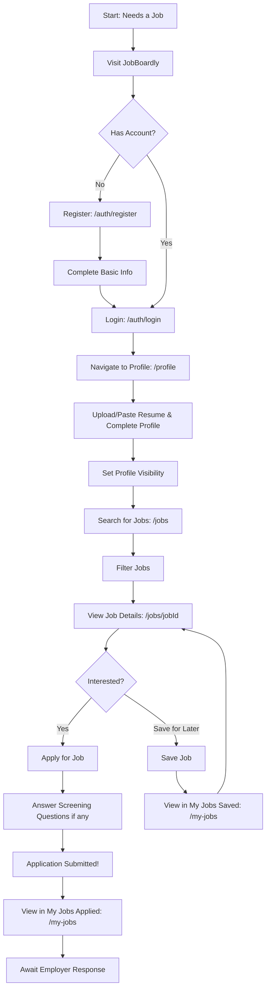
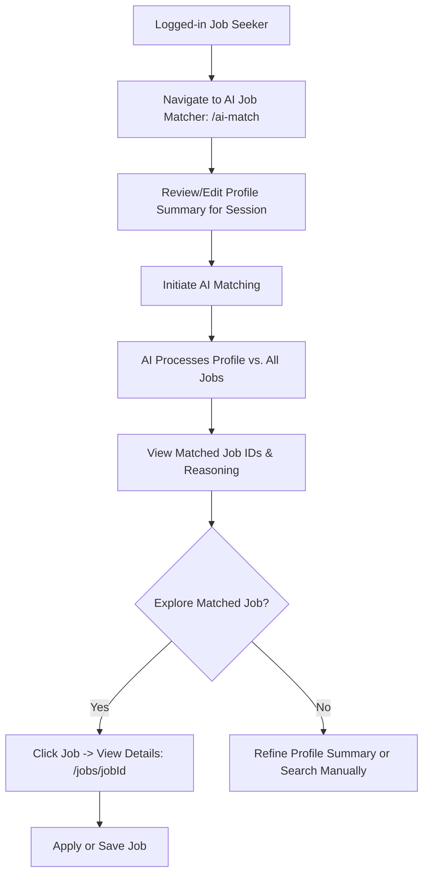

# JobBoardly - Job Seeker Features Guide

Welcome to the JobBoardly Job Seeker Guide! This document details the features available to help you find your next career opportunity.

## 1. Core Goal

To provide job seekers with a comprehensive, AI-enhanced platform to manage their professional profile, search for relevant jobs, apply seamlessly, and track their job-seeking journey.

## 2. Key Features

### 2.1. Authentication & Account Management

- **Secure Registration**: Sign up using Email/Password or social providers (Google, GitHub, Microsoft). Includes password strength indicators.
- **Login**: Access your account securely.
- **Change Password**: A dedicated page to update your account password.
- **Account Status**: Your account can be 'active' or 'suspended' (by an admin). Suspended accounts cannot log in.

### 2.2. Profile Management (`/profile`)

- **Comprehensive Profile Sections**:
  - **Personal Information**: Name, Avatar, Mobile, Gender, Date of Birth, Home City/State.
  - **Professional Headline**: A short tagline to summarize your professional identity.
  - **Professional Summary**: A detailed summary of your career, often pre-filled by AI from your resume.
  - **Skills**: List your technical and soft skills.
  - **Work Experience**: Add detailed entries for each role (Company, Job Role, Duration, Description, Annual CTC).
  - **Education**: Detail your educational qualifications (Level, Degree, Institute, Batch, Specialization, Course Type, Description). Mark your most relevant qualification.
  - **Languages**: Specify languages known with proficiency (Read, Write, Speak).
  - **Total Experience**: Calculated or manually entered total years and months of professional experience.
  - **Compensation**: Specify current and expected annual CTC (in INR), with options for confidentiality and negotiability.
  - **Links**: Portfolio URL, LinkedIn Profile URL.
- **Resume Management**:
  - **Upload Resume**: Upload your resume (PDF, DOCX, TXT).
  - **Paste Resume Text**: Alternatively, paste your resume content directly.
  - **AI Resume Parsing**: Our AI attempts to parse your resume (uploaded or pasted) to pre-fill sections of your profile like summary, skills, and potentially structure experience/education.
  - _Note_: Plain text (.txt or pasted) generally yields the best parsing results.
  - **Stored Resume**: Your uploaded resume file can be stored and downloaded.
- **Profile Visibility**: Control whether your profile is searchable by employers or kept private.
- **Downloadable PDF Profile**: Download a clean, ATS-friendly PDF version of your profile (`/profile`).
- **Profile Preview (`/profile/preview`)**: See how your profile might appear to employers.

### 2.3. Job Discovery

- **Job Search & Filtering (`/jobs`)**:
  - Browse a comprehensive list of approved job postings.
  - **Filters**:
    - Keywords (searches title, company, skills).
    - Location.
    - Role Type (Full-time, Part-time, etc.).
    - Remote option.
    - Recent Activity (e.g., posted in the last 7 days).
  - **View Modes**: Switch between Grid and List view for job listings.
- **Dynamic Job Detail Pages (`/jobs/[jobId]`)**:
  - View complete details for each job: description, responsibilities, qualifications, skills, salary, company info.
  - **Share Functionality**: Copy a direct link to the job posting.
- **Company Profile Pages (`/companies/[companyId]`)**:
  - View details about companies, including their open positions.

### 2.4. Application & Job Management

- **Apply for Jobs**:
  - Submit applications directly through the platform.
  - If a job has **Screening Questions** (defined by the employer), you'll answer them during the application process.
- **Save Jobs**: Bookmark jobs you're interested in for later review or application.
- **My Jobs Page (`/my-jobs`)**:
  - A centralized dashboard to view and manage:
    - **Saved Jobs**: Jobs you've bookmarked.
    - **Applied Jobs**: Jobs you've submitted applications for.
  - Filter jobs by status (All, Applied, Saved).

### 2.5. AI-Powered Job Matching (`/ai-match`)

- Input or review your comprehensive profile summary (editable for the session).
- The AI matches your profile (including detailed work experience, education, skills, languages, preferences like salary and location, and total experience) against all available approved job postings.
- Receive a list of relevant job IDs and a detailed reasoning for the matches.

### 2.6. User Settings (`/settings`)

- **Theme Customization**: Choose between Light, Dark, or System preference for the platform's appearance. Your choice is saved to your profile.
- **Notification Preferences**: Manage how you receive alerts (e.g., new jobs matching profile, application status updates).
- **Manage Saved Searches**: View, apply, or delete your saved job search criteria.
- **Job Board Display Preferences**: Set your default view (list/grid) and items per page for job listings.

## 3. User Journey Maps (Job Seeker)

### Journey 1: Registration to Application

### Journey 2: AI Job Matching

## 4. Page Routes

| Route                    | Description                                                    | Access Level |
| :----------------------- | :------------------------------------------------------------- | :----------- |
| `/`                      | Home page, redirects to `/jobs` if logged in as job seeker.    | Public       |
| `/auth/login`            | Job seeker login page.                                         | Public       |
| `/auth/register`         | Job seeker registration page.                                  | Public       |
| `/auth/change-password`  | Page to change account password.                               | Job Seeker   |
| `/profile`               | Manage personal and professional profile, resume, visibility.  | Job Seeker   |
| `/profile/preview`       | Preview how your profile appears to employers.                 | Job Seeker   |
| `/jobs`                  | Browse and filter job listings.                                | Public       |
| `/jobs/[jobId]`          | View detailed information about a specific job.                | Public       |
| `/companies`             | Browse company listings.                                       | Public       |
| `/companies/[companyId]` | View detailed information about a specific company.            | Public       |
| `/my-jobs`               | Dashboard to view and manage saved and applied jobs.           | Job Seeker   |
| `/ai-match`              | AI-powered job matching tool based on your profile.            | Job Seeker   |
| `/settings`              | Manage account settings, theme, notifications, saved searches. | Job Seeker   |
| `/privacy-policy`        | Platform's privacy policy.                                     | Public       |
| `/terms-of-service`      | Platform's terms of service.                                   | Public       |

## 5. Key "API" Interactions (Data Flows with Genkit & Firebase)

Job seekers interact with AI features via Genkit flows and their profile data is stored in Firebase Firestore.

- **Resume Parsing (`parseResumeFlow`):**

  - **Action**: User uploads a resume file or pastes resume text on the `/profile` page.
  - **Input Data**:
    - `resumeDataUri`: The resume content as a data URI (Base64 encoded, with MIME type).
  - **Interaction**: Calls the `parseResumeFlow` Genkit flow.
  - **Output Data (from AI)**: A structured JSON object (`ParseResumeOutput`) containing:
    - `name?`: string
    - `email?`: string
    - `mobileNumber?`: string
    - `headline?`: string
    - `skills?`: string[]
    - `experience?`: string (detailed summary)
    - `education?`: string (detailed summary)
    - `portfolioUrl?`: string
    - `linkedinUrl?`: string
    - `totalYearsExperience?`: number
  - **Effect**: Parsed data is used to suggest pre-fills for the user's profile form. The `parsedResumeText` (combined experience and education summaries) is stored in the user's profile.

- **AI-Powered Job Matching (`aiPoweredJobMatching`):**

  - **Action**: User navigates to `/ai-match` and initiates matching.
  - **Input Data**:
    - `jobSeekerProfile`: A string containing a comprehensive summary of the job seeker's profile (editable for the session). Includes skills, experience details, education details, preferences (salary, location), total experience, etc.
    - `jobPostings`: A string containing a collection of all available, approved job postings with their details (ID, title, company, description, skills, salary range, etc.).
  - **Interaction**: Calls the `aiPoweredJobMatching` Genkit flow.
  - **Output Data (from AI)**: A structured JSON object (`AIPoweredJobMatchingOutput`) containing:
    - `relevantJobIDs`: string[] (Array of job IDs, ordered by relevance)
    - `reasoning`: string (Detailed explanation for the matches)
  - **Effect**: Displays the matched jobs and reasoning to the user.

- **Profile & Application Data (Firebase Firestore):**
  - **User Profile**: All details entered in `/profile` (personal info, experience, education, skills, preferences, resume URL/text, settings like theme, etc.) are stored in the `users` collection in Firestore, keyed by user UID.
  - **Job Application**: When a user applies for a job, an `application` document is created in the `applications` collection in Firestore. This includes `jobId`, `applicantId`, `appliedAt`, status ('Applied'), and any answers to screening questions. The `jobId` is also added to the `appliedJobIds` array in the user's profile.
  - **Saved Jobs/Searches**: `savedJobIds` (array of job IDs) and `savedSearches` (array of search criteria objects) are stored in the user's profile document in Firestore.

## 6. Future Updates (Potential Enhancements)

- **Advanced Resume Builder**: Tools to help create or improve resumes directly on the platform.
- **Skill Assessments**: Optional tests to verify skills and earn badges for their profile.
- **Interview Preparation Tools**: Resources and AI-powered mock interviews.
- **Career Path Suggestions**: AI-driven recommendations for career growth based on profile and job market trends.
- **Direct Messaging with Recruiters**: Secure communication channel (post-application or if recruiter initiates).
- **Enhanced Notifications**: More granular control over job alerts (e.g., daily/weekly digests, specific company alerts).
- **Gamification**: Points or badges for profile completion, applications, etc.
- **Networking Features**: Ability to connect with other professionals or mentors on the platform.

---

_This guide is intended for informational purposes for the JobBoardly team._
