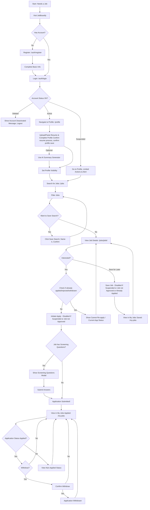
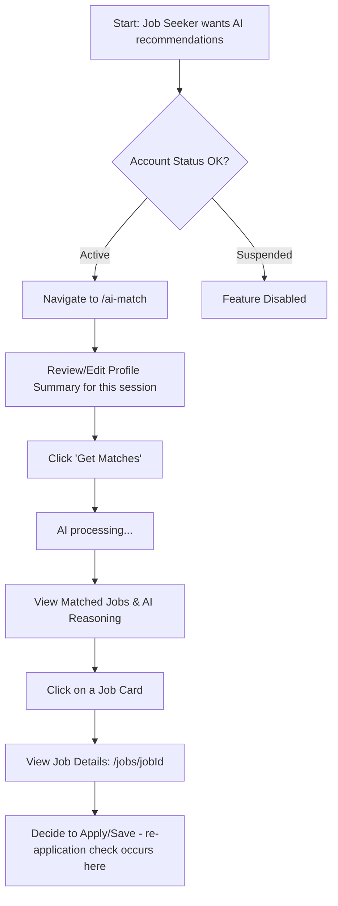
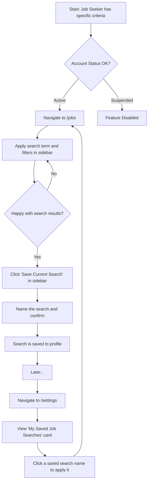

# JobBoardly - Job Seeker Features Guide

Welcome to the JobBoardly Job Seeker Guide! This document details the features available to help you find your next career opportunity.

## 1. Core Goal

To provide job seekers with a comprehensive, AI-enhanced platform to manage their professional profile, search for relevant jobs, apply seamlessly, and track their job-seeking journey.

## 2. Key Features

### 2.1. Authentication & Account Management

- **Secure Registration**: Sign up using Email/Password or social providers (Google, GitHub, Microsoft). Includes password strength indicators.
- **Login**: Access your account securely.
- **Change Password**: A dedicated page to update your account password. This action requires confirmation.
- **Account Status**: Your account can be 'active', 'suspended', or 'deleted' (by an admin).
  - **Suspended Accounts**: Can log in but have limited functionality. Cannot apply for jobs, edit main profile sections (like experience, education, skills), save jobs, or use AI job matcher. Can view jobs, change password, and adjust some settings (like theme, view saved searches, but cannot create new or delete saved searches). An alert will be displayed on relevant pages.
  - **Deleted Accounts**: Cannot log in. If Firebase Authentication succeeds, the application will immediately log the user out and display a message indicating the account is deactivated.

### 2.2. Profile Management (`/profile`)

- **Comprehensive Profile Sections**:
  - **Personal Information**: Name, Avatar, Mobile, Gender, Date of Birth, Home City/State.
  - **Professional Headline**: A short tagline to summarize your professional identity.
  - **Professional Summary**: A detailed summary of your career, often pre-filled by AI from your resume, or generated by AI based on your profile and a target.
  - **Skills**: List your technical and soft skills.
  - **Work Experience**: Add detailed entries for each role (Company, Job Role, Duration, Description, Annual CTC).
  - **Education**: Detail your educational qualifications (Level, Degree, Institute, Batch, Specialization, Course Type, Description). Mark your most relevant qualification.
  - **Languages**: Specify languages known with proficiency (Read, Write, Speak).
  - **Total Experience**: Calculated or manually entered total years and months of professional experience.
  - **Compensation**: Specify current and expected annual CTC (in INR), with options for confidentiality and negotiability.
  - **Preferences**: Set your `Notice Period` and preferred work locations.
  - **Links**: Portfolio URL, LinkedIn Profile URL.
- **Resume Management**:
  - **Upload Resume**: Upload your resume (PDF, DOCX, TXT). Processing this requires confirmation.
  - **Paste Resume Text**: Alternatively, paste your resume content directly. Processing this requires confirmation.
  - **AI Resume Parsing**: Our AI attempts to parse your resume (uploaded or pasted) to pre-fill sections of your profile like summary, skills, and potentially structure experience/education.
  - _Note_: Plain text (.txt or pasted) generally yields the best parsing results.
  - **Stored Resume**: Your uploaded resume file can be stored and downloaded. Removing the resume requires confirmation.
- **AI Summary Generator**:
  - Input a target role or company.
  - AI generates a tailored professional summary based on your profile data.
  - Option to copy the generated summary to your main profile summary field.
- **Profile Visibility**: Control whether your profile is searchable by employers or kept private.
- **Downloadable PDF Profile**: Download a clean, ATS-friendly PDF version of your profile (`/profile`).
- **Profile Preview (`/profile/preview`)**: See how your profile might appear to employers.
- **Saving Profile Changes**: Requires confirmation before updates are saved.
- _Note_: If your account is 'suspended', most profile editing features will be disabled, and saving changes will be blocked.

### 2.3. Job Discovery

- **Job Search & Filtering (`/jobs`)**:
  - Browse a comprehensive list of approved job postings.
  - **Filters**:
    - Keywords (searches title, company, skills, responsibilities, requirements).
    - Location, Role Type, Remote option, Recent Activity.
    - Salary Range (Min/Max).
    - Experience Level.
    - Minimum Years of Experience.
  - **Save Current Search**: Ability to save the current combination of search term and filters as a "Saved Search" with a custom name. (See Settings for management). Saving a search requires confirmation.
  - **View Modes**: Switch between Grid and List view for job listings.
- **Dynamic Job Detail Pages (`/jobs/[jobId]`)**:
  - View complete details for each job: `responsibilities`, `requirements`, qualifications, skills, salary, company info, and benefits.
  - **Share Functionality**: Copy a direct link to the job posting.
  - Screening questions are _not_ visible on the public job detail page.
- **Company Profile Pages (`/companies/[companyId]`)**:
  - View details about companies, including their open positions.

### 2.4. Application & Job Management

- **Apply for Jobs**:
  - Submit applications directly through the platform (only for 'approved' jobs).
  - If a job has **Screening Questions** (defined by the employer), you'll answer them (text, yes/no supported) during the application process via a modal. Answers are final once submitted with the application.
- **Re-application Prevention**: Once an application is submitted (even if later withdrawn or rejected by the company), you cannot re-apply for the same job. The "Apply Now" button will be disabled or show the current application status.
- **Withdraw Application**: From the "My Jobs" page or the job detail page (if applied and status is 'Applied'), you can withdraw an active application. This action requires confirmation. Withdrawn applications change status to 'Withdrawn by Applicant' and cannot be re-submitted.
- **Save Jobs**: Bookmark 'approved' jobs you're interested in for later review or application. This action is disabled if you have already applied for the job.
- **My Jobs Page (`/my-jobs`)**:
  - A centralized dashboard to view and manage:
    - **Saved Jobs**: Jobs you've bookmarked.
    - **Applied Jobs**: Jobs you've submitted applications for, showing their current status (e.g., Applied, Reviewed, Withdrawn by Applicant, Rejected By Company). The option to withdraw an 'Applied' application is available here.
  - Filter jobs by status (All, Applied, Saved, Withdrawn).

### 2.5. AI-Powered Job Matching (`/ai-match`)

- Input or review your comprehensive profile summary (editable for the session).
- The AI matches your profile (including detailed work experience, education, skills, languages, preferences like salary, location, and `noticePeriod`) against all available approved job postings.
- Receive a list of relevant job IDs and a detailed reasoning for the matches.
- _Note_: Disabled if your account is 'suspended'.

### 2.6. User Settings (`/settings`)

- **Theme Customization**: Choose between Light, Dark, or System preference.
- **Notification Preferences**: Basic UI for toggling notification categories (backend triggers pending).
- **Manage Saved Searches**: View, apply, or delete saved job searches.
- **Job Board Display Preferences**: Set your default view (list/grid) and items per page.
- **Local Search History**: View and clear your device-specific search term history.

## 3. User Journey Maps (Job Seeker)

### Journey 1: Registration to Application

### Journey 2: AI Job Matching

### Journey 3: Managing Saved Searches

## 4. Page Routes

| Route                    | Description                                                                                                                                                                                   | Access Level |
| :----------------------- | :-------------------------------------------------------------------------------------------------------------------------------------------------------------------------------------------- | :----------- |
| `/`                      | Home page, redirects to `/jobs` if logged in as job seeker.                                                                                                                                   | Public       |
| `/auth/login`            | Job seeker login page. If account is 'deleted', login may fail post-auth check.                                                                                                               | Public       |
| `/auth/register`         | Job seeker registration page.                                                                                                                                                                 | Public       |
| `/auth/change-password`  | Page to change account password. (Accessible if suspended). Requires confirmation.                                                                                                            | Job Seeker   |
| `/profile`               | Manage profile. Editing restricted if account 'suspended'. Profile save requires confirmation.                                                                                                | Job Seeker   |
| `/profile/preview`       | Preview profile. (Accessible if suspended).                                                                                                                                                   | Job Seeker   |
| `/jobs`                  | Browse, filter, and save job searches. (Saving search disabled if suspended).                                                                                                                 | Public       |
| `/jobs/[jobId]`          | View job details, including company info header. Apply/Save actions disabled if account 'suspended', job not 'approved', or application already exists. Withdraw option available if applied. | Public       |
| `/companies`             | Browse company listings.                                                                                                                                                                      | Public       |
| `/companies/[companyId]` | View company details.                                                                                                                                                                         | Public       |
| `/my-jobs`               | Dashboard for saved/applied jobs. Includes withdraw option. Viewing allowed if 'suspended'.                                                                                                   | Job Seeker   |
| `/ai-match`              | AI job matching tool. Disabled if account 'suspended'.                                                                                                                                        | Job Seeker   |
| `/settings`              | Manage settings (theme, job board display, saved searches, notification settings). Most disabled if account 'suspended', except theme. Deleting saved search needs confirm.                   | Job Seeker   |
| `/privacy-policy`        | Platform's privacy policy. Content is editable by SuperAdmins.                                                                                                                                | Public       |
| `/terms-of-service`      | Platform's terms of service. Content is editable by SuperAdmins.                                                                                                                              | Public       |

## 5. Key "API" Interactions (Data Flows with Genkit & Firebase)

Job seekers interact with AI features via Genkit flows and their profile data is stored in Firebase Firestore. Key actions like profile updates, resume processing, and managing saved searches require user confirmation.

- **Resume Parsing (`parseResumeFlow`):** (As before)
- **AI-Powered Job Matching (`aiPoweredJobMatching`):** (As before, but UI access restricted if account suspended)
- **AI Dynamic Summary Generation (`generateProfileSummaryFlow`):** (As before)
- **Profile & Application Data (Firebase Firestore):**

  - **User Profile**: All details entered in `/profile` are stored in the `users` collection. Profile updates require confirmation. Editing restricted if account 'suspended'.
  - **Job Application**: An `application` document is created in the `applications` collection, now including `answers` to screening questions. Disabled if account 'suspended'. Re-application to the same job by the same user is prevented by checking existing application status.
  - **Withdraw Application**: Updates the `status` of an existing `application` document to `'Withdrawn by Applicant'`. Requires confirmation.
  - **Saved Jobs/Searches**: Stored in the user's profile document (`savedJobIds` as string array, `savedSearches` as array of SavedSearch objects). Saving/unsaving jobs and saving/deleting searches disabled if account 'suspended' or job already applied for. Deleting saved searches requires confirmation.

- **Saving a Search:** (As before)
- **Deleting a Saved Search:** (As before)

## 6. Future Updates (Potential Enhancements)

- **Advanced Resume Builder**: Tools to help create or improve resumes directly on the platform.
- **Skill Assessments**: Optional tests to verify skills and earn badges for their profile.
- **Interview Preparation Tools**: Resources and AI-powered mock interviews.
- **Career Path Suggestions**: AI-driven recommendations for career growth based on profile and job market trends.
- **Direct Messaging with Recruiters**: Secure communication channel (post-application or if recruiter initiates).
- **Enhanced Notifications**: Full implementation as per `docs/notification-system-plan.md`.
- **Gamification**: Points or badges for profile completion, applications, etc.
- **Networking Features**: Ability to connect with other professionals or mentors on the platform.
- **Clearer guidance for suspended users** on how to resolve their account status.
- **Support for Multiple Choice & Checkbox Screening Questions**: Enhance the UI for job seekers to answer these types.
- For a broader look at upcoming platform features, refer to the [Future Development Roadmap](../future-development-roadmap.md).
- Extensive AI-powered enhancements are planned, including AI Career Path Advisor and AI Job Concierge. See `docs/ai-features-roadmap.md` for the full AI vision.

---

_This guide is intended for informational purposes for the JobBoardly team._
